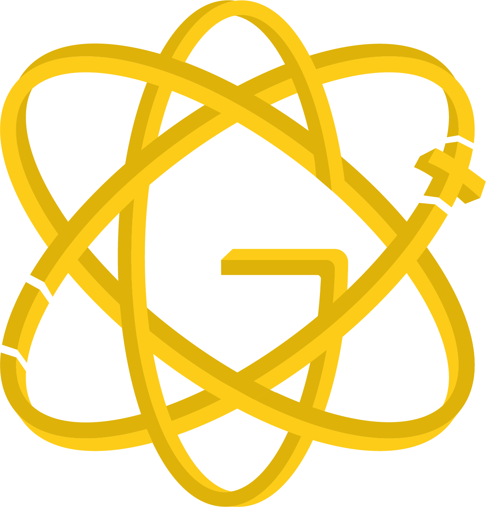

<!-- Don't delete it -->
<div name="readme-top"></div>

<!-- Logos -->
<div align="center" style="display:flex;align-items:center;justify-content:center;gap:16px;">
  
  
</div>

<p align="center">
  <a href="https://stability.nexus/">
    
  </a>
</p>

<p align="center">
  <a href="https://t.me/StabilityNexus"></a>
  &nbsp;&nbsp;
  <a href="https://x.com/StabilityNexus"></a>
  &nbsp;&nbsp;
  <a href="https://discord.gg/YzDKeEfWtS"></a>
  &nbsp;&nbsp;
  <a href="https://news.stability.nexus/"></a>
  &nbsp;&nbsp;
  <a href="https://linkedin.com/company/stability-nexus"></a>
  &nbsp;&nbsp;
  <a href="https://www.youtube.com/@StabilityNexus"></a>
</p>

---

# Gluon Protocol — Dual-Token Mechanics (Solana)

**Gluon** is a Stability Nexus research initiative delivering a **two-token stable-asset system** on Solana.

- **Stable token** (*neutron*): targets peg reliability for on-chain commerce.  
- **Leveraged token** (*proton*): captures reserve surplus and price reflexivity.

The system uses **Anchor** smart contracts, **Pyth** oracles, and Solana’s high-throughput runtime to coordinate **fission**, **fusion**, and **transmutation** in real time.

> 📄 **Whitepaper**:  [`Gluon`](https://eprint.iacr.org/2025/1372).

---

## Table of Contents

- [Overview](#overview)
- [Architecture](#architecture)
- [Repository Layout](#repository-layout)
- [Prerequisites](#prerequisites)
- [Configuration](#configuration)
- [Quick Start (Frontend)](#quick-start-frontend)
- [Anchor Program Workflow](#anchor-program-workflow)
- [Testing](#testing)
- [Build & Deploy](#build--deploy)
- [Scripts](#scripts)
- [Troubleshooting](#troubleshooting)
- [Contributing](#contributing)
- [Security](#security)
- [License](#license)

---

## Overview

- **Dual-token design** – Split a base reserve into **stable** (peg-focused) and **reflexive** (leveraged) claims. Recombine or transmute between them as market conditions change.  
- **Solana-native** – Programs are written with **Anchor**, designed for composability with the broader Solana DeFi stack.  
- **Oracle-aware solvency** – **Pyth** price feeds and internal health metrics drive fees, route availability, and guardrails against under-collateralization.  
- **Deterministic UX** – The frontend provides clear flows for minting, redeeming, and transmutation, with typed clients generated from IDLs.

---

## Architecture

**Core mechanics**

- **Fission** — Split base collateral into neutron (stable) and proton (leveraged) claims.  
- **Fusion** — Recombine proton and neutron back into base collateral.  
- **Transmutation** — Convert between claim types along protocol-defined routes (subject to fees/health).  
- **Decay/Reflexivity** — System parameters modulate risk/return to keep reserves healthy and the peg robust.

**Components**

- **Anchor Programs** — On-chain accounting, mint/redeem/transmute instructions, fee logic, and guardrails.  
- **Pyth Oracles** — External prices for solvency checks and parameterization.  
- **Next.js Frontend** — Interaction console for user flows, wallet connectivity, and transaction previews.

---

## Repository Layout

```
.
├── src/                   # Next.js (App Router) frontend
├── public/                # Static assets (logos, diagrams)
├── anchor/                # Anchor workspace: programs + tests
├── jest.config.js         # Jest config (incl. bankrun/localnet)
├── package.json           # Frontend + Anchor scripts
└── README.md
```

**Key paths**

- `src/app/[coinId]/InteractionClient.tsx` — UI for fission, fusion, transmutation.  
- `anchor/programs/` — Rust programs compiled by Anchor.  
- `anchor/tests/` — TypeScript integration tests for localnet/devnet.

---

## Prerequisites

- **Node.js** ≥ 18 and **npm** ≥ 9 (or pnpm/yarn)  
- **Rust & Cargo** (install via [rustup](https://rustup.rs/))  
- **Solana CLI** ≥ 1.18  
- **Anchor CLI** ≥ 0.30

Verify:

```bash
node -v
solana --version
anchor --version
```

---

## Configuration

Create a **`.env.local`** for the frontend:

```bash
NEXT_PUBLIC_SOLANA_NETWORK=devnet
NEXT_PUBLIC_SOLANA_RPC_URL=https://api.devnet.solana.com
# Optional: surface on-chain IDs for programs/mints/reactors, e.g.:
# NEXT_PUBLIC_PROGRAM_ID=...
# NEXT_PUBLIC_NEUTRON_MINT=...
# NEXT_PUBLIC_PROTON_MINT=...
```

- Prefer a private RPC (Helius/Light/Triton) for better throughput.  
- Anchor CLI also reads `~/.config/solana/cli/config.yml` for cluster/wallet.

---

## Quick Start (Frontend)

```bash
# 1) Install deps
npm install

# 2) Run the dev server
npm run dev
# → http://localhost:3000
```

> If you change IDLs or generated clients, **restart** the dev server so types refresh.

---

## Anchor Program Workflow

Most protocol logic lives in `anchor/`.

```bash
# 1) Build programs
npm run anchor-build

# 2) Start a local validator
solana-test-validator --reset
npm run anchor-localnet   # shortcut for `anchor localnet`

# 3) Deploy to local validator
cd anchor
anchor deploy

# 4) Test
npm run anchor-test        # anchor test runner (Rust + TS)
npm run test:anchor        # jest + bankrun (fast unit-style)
npm run test:devnet        # devnet tests (needs funded wallet + RPC)
```

> `anchor localnet` spins up a validator and deploys built programs automatically.  
> Use `solana-test-validator` if you need fine-grained control or to side-load extra programs.

---

## Testing

| Target               | Command               | Notes                                                                 |
|---------------------|-----------------------|-----------------------------------------------------------------------|
| Anchor integration  | `npm run anchor-test` | Executes Rust+TS tests against localnet via Anchor.                   |
| Jest (bankrun)      | `npm run test:anchor` | Uses `solana-bankrun` for fast, deterministic checks.                 |
| Jest (devnet)       | `npm run test:devnet` | Requires devnet wallet & RPC; exits on hanging handles.               |
| Lint                | `npm run lint`        | Next.js/TypeScript preset.                                            |
| Format              | `npm run format:check`| Verify Prettier formatting (`npm run format` to apply).               |

Artifacts live in `anchor/target/idl/`,

---

## Build & Deploy

### Frontend

```bash
npm run build     # production build
npm run start     # preview locally (after build)
```

Deploy to Vercel/Cloudflare/Docker. Remember to set required env vars.

### Contracts

```bash
npm run anchor-build

cd anchor
anchor keys list
anchor build
anchor deploy --provider.cluster devnet  
```

Export new program/mint/reactor IDs to the frontend via `.env.local` or `src/config`.

---

## License

© 2025 Stability Nexus. All rights reserved.  
If you intend to open-source this project, replace this section with the appropriate license (e.g., MIT/Apache-2.0) and add a `LICENSE` file.
